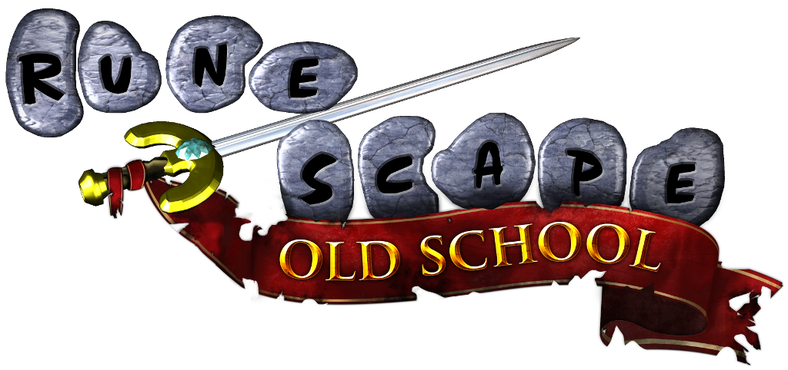

# OSRSdle

## Overview

This is a fun and interactive guessing game built with **React** where players try to identify various bosses from the game *Old School RuneScape (OSRS)*. The game presents random information about an OSRS boss, and the user must guess the boss by typing the name into the search bar. The game provides real-time feedback on whether the guess is correct or incorrect, turning the corresponding cell in the table green for correct guesses and red for incorrect guesses.

The game also includes search and autocomplete features to help users find bosses faster, and keeps track of their guessing history.

## Features

- **Search and Autocomplete:** Type in the search bar, and it will show boss suggestions based on the search query.
- **Boss Information:** The game displays detailed information about the boss, including combat level, hitpoints, release date, attack style, and location.
- **Random Boss Selection:** A random boss is selected at the start of the game, and users guess the boss based on the displayed information.
- **Guess History:** Tracks the user's guesses, showing correct and incorrect guesses in the history.
- **Responsive UI:** The game is designed to be responsive and works across different screen sizes.

## Game Modes

### Classic Mode

In **Classic Mode**, players are presented with various details about an OSRS boss (like combat level, hitpoints, release date, etc.), and they must type in the name of the boss. The game will provide feedback on whether the guess was correct or incorrect and display the boss name with the correct or incorrect highlight in the history list. The user can continue guessing multiple bosses with each guess being tracked.

### Bosses Mode

In **Bosses Mode**, the game presents a blurred image of the random boss and as users make guesses, each correct or incorrect guess progressively **unblurs** parts of the boss's image. The goal is to guess the boss's name while the image remains partially blurred for as long as possible. Each guess gradually reveals more information, making it easier to guess the correct boss over time.

## Technologies

- **React:** 
- **Axios:** 
- **CSS:** 